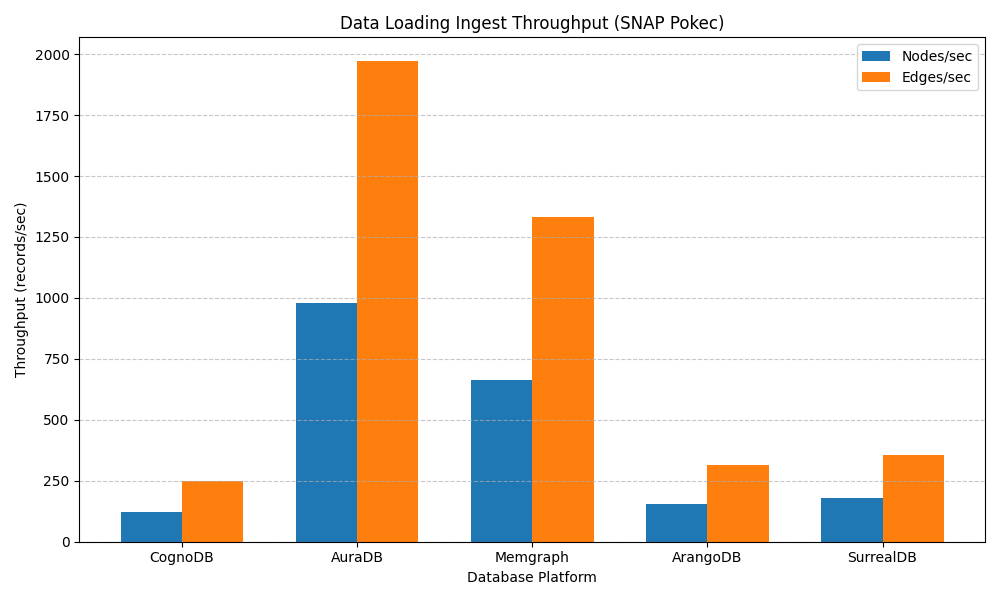
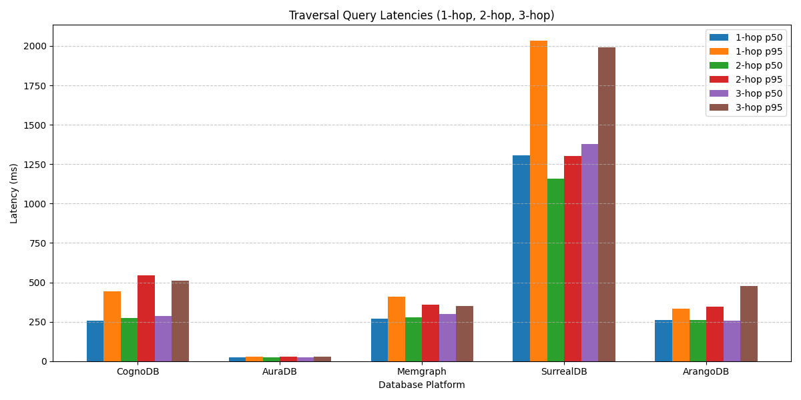
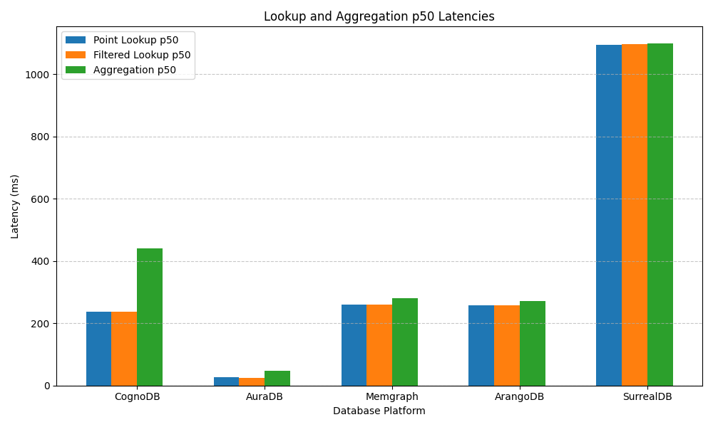
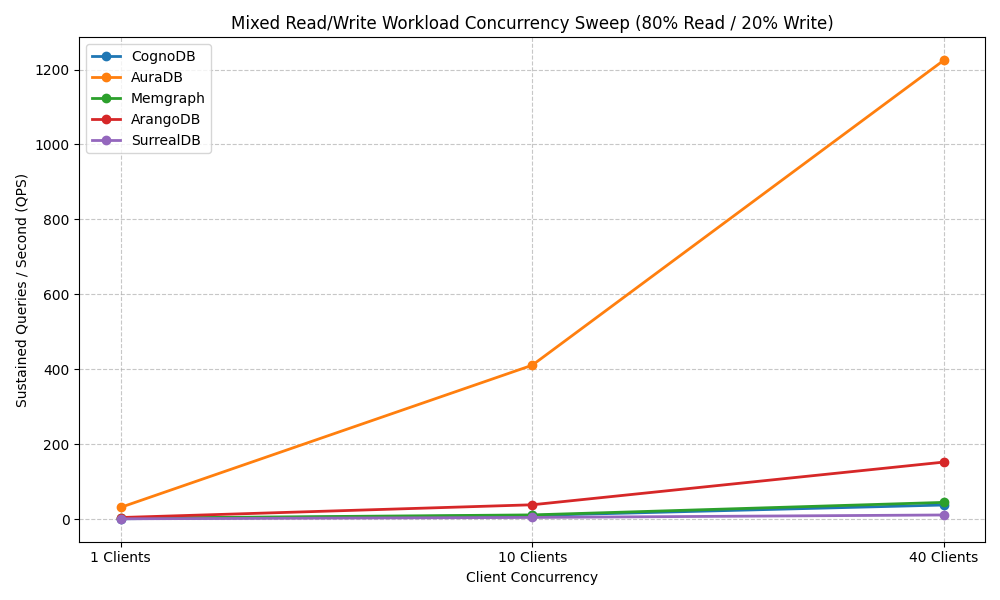

# Graph Database Cloud Benchmarking: CognoDB vs. Competitors

In this repo, we created a reproducible benchmark suite comparing CognoDB Cloud against managed graph database cloud platforms (Neo4j AuraDB, Memgraph Cloud, ArangoDB Cloud, and SurrealDB Cloud) using identical datasets and query workloads under strict resource parity.

## Provider Selection

This benchmark suite evaluates CognoDB Cloud against four managed graph database platforms. The goal is a reproducible performance assessment across data loading, graph traversals, lookups, aggregations, and concurrent read/write throughput.

### Database Selection Criteria

Our selection criteria came down to matching free-tier resource capabilities as closely as possible to CognoDB's free tier, balancing technology similarity with architectural contrast:

- **Similar Technology Stack**: We chose [Neo4j AuraDB](https://neo4j.com/cloud/platform/auradb/) and [Memgraph](https://memgraph.com/) to compare against native Cypher/Bolt protocol implementations.
- **Different Architectural Methods**: We included multi-model and document-graph engines like [ArangoDB](https://www.arangodb.com/) to contrast native graph engines against alternative storage methods, and also since a lot of other studies tries to benchmark ArangoDB againts native graph a lot.
- **Seldom-Used Comparison**: To enrich data analysis, we also decided to pick a less popular provider and technology like [SurrealDB](https://surrealdb.com/) was specifically included as a less common multi-model database to evaluate how modern multi-model engines handle graph workloads and compare againts native one.

Our selection criteria also takes consideration from published benchmarks and comparative studies:

- [Benchmarking Graph Databases: Neo4j vs Amazon Neptune vs ArangoDB](https://www.researchgate.net/publication/389357088_Benchmarking_Graph_Databases_Neo4j_vs_Amazon_Neptune_vs_ArangoDB)
- [ArcadeDB Performance Benchmarks](https://arcadedb.com/benchmarks.html)
- [PuppyGraph: ArangoDB vs Neo4j Benchmark Analysis](https://www.puppygraph.com/blog/arangodb-vs-neo4j)

### Selected Databases

Our final choices came down to the following four platforms:

1. [Neo4j AuraDB](https://neo4j.com/cloud/platform/auradb/)
2. [Memgraph](https://memgraph.com/)
3. [ArangoDB](https://www.arangodb.com/)
4. [SurrealDB](https://surrealdb.com/)

### Overview

Here we provide overview of proposed cloud providers underlying technology to get a better understanding of what we are actually comparing here.

| Provider Name       | Query Language | DB Engine                    | Network Protocol          |
| :------------------ | :------------- | :--------------------------- | :------------------------ |
| **CognoDB Cloud**   | Cypher         | Native Graph Engine          | Bolt (`bolt+s`)           |
| **Neo4j AuraDB**    | Cypher         | Native Graph Engine          | Bolt (`neo4j+s`)          |
| **Memgraph Cloud**  | Cypher         | In-Memory Native Graph       | Bolt (`bolt+s`)           |
| **ArangoDB Oasis**  | AQL            | Multi-Model (Document/Graph) | HTTP/REST (`https`)       |
| **SurrealDB Cloud** | SurrealQL      | Multi-Model (Document/Graph) | HTTP/WebSockets (`https`) |

We understand that different technologies produce different speed because of their purposes, however thats the exact reason we are benchmarking it here.

## Hardware & Environment

All providers were used by their lowest/free tier available plan. All regions are picked to the same US-EAST configuration to ensure same travel latency and since all provider happen to have that available.

Although some hardware specs are not exposed by the provider, they should still yield similar performance while we also did some programmatic resource capping for further fairness strictness down below.

### Advertised Provider Specs

| Database Platform   | vCPU             | RAM            | Storage Limit  |
| :------------------ | :--------------- | :------------- | :------------- |
| **CognoDB Cloud**   | 0.5 vCPU (burst) | 512 MB         | 1.0 GB         |
| **Neo4j AuraDB**    | Not advertised   | Not advertised | Not advertised |
| **Memgraph Cloud**  | 1.0 vCPU         | 2.0 GB         | Not advertised |
| **ArangoDB Oasis**  | 0.25 vCPU        | 512 MB         | 1.0 GB         |
| **SurrealDB Cloud** | 0.25 vCPU        | 512 MB         | 40 GB          |

### Code-Level Resource Enforcement for Fairness

We tried our best to chose matching the specs as much as possible, but to the best of our knowledge, these are the closes possible resource matching provider there is to CognoDB free tier, in the end because cloud providers offer different default specs on their free tiers as reported per the table, running benchmarks directly on out-of-the-box hardware would yield an unfair comparison.

To eliminate hardware advantages, we try our best to runner programmatically cap all platforms at runtime to match performance as much as possible:

- **RAM & Storage Capping**: `ResourceCapEnforcer` programmatically verifies in-memory payload buffers (capped at 512 MB) and total estimated disk footprints (capped at 1.0 GB) before executing workloads. This is reliable because client dataset payload sizes and batch memory buffers are strictly measured and bounded before execution, ensuring no database exceeds free-tier memory or storage limits.

- **CPU Duty-Cycle Regulation**: `CpuFairnessRegulator` inserts inter-query sleep delays based on measured query execution times to equalize query frequency across providers. Note that client-side throttling regulates query issue rates rather than enforcing a true OS-level container CPU cap on the remote server host. For readers who prefer unthrottled raw provider performance, this regulator can be toggled off via code (`apply_cpu_throttling=False`).

Hence readers need to take this comparison with a grain of salt, **the biggest factor is the CPU power** from each provider because we cannot reliably enforce OS level strictness, for RAM and storage we can cap it effectively though.

## Dataset & Queries

### Dataset

- **Source**: SNAP soc-Pokec social network graph sample.
- **Scale**: 100,000 sampled relationships (edges) and 19,103 connected nodes.
- **Node Attributes**: `id` (integer), `name` (string), `gender` (integer), `region` (string), `age` (integer).

### Indexing

- **Primary Index**: Range/hash index on `Person(id)`.
- **Composite Index**: Compound index on `Person(age, region)`.

### Query Workloads

- **Data Ingest**: Bulk loading 19,103 nodes and 100,000 edges. Measured in nodes/sec, edges/sec, and total wall-clock time.
- **Graph Traversals**: 1-hop, 2-hop, and 3-hop query latency (p50 and p95) sampled across 100 random starting nodes.
- **Point Lookups**: Key lookup by node `id`.
- **Filtered Lookups**: Range and equality filter matching `age` and `region`.
- **Aggregations**: Group-by aggregation (`count(p)` and `avg(p.age)` grouped by `region`).
- **Mixed Concurrency**: 80% read / 20% write workload evaluated across 1, 10, and 40 concurrent client threads.
- **Query Warmup**: Prior to recording latencies, `benchmark.py` executes an explicit warmup pass across all query adapters to warm up engine query planners and page caches. All reported p50 and p95 latency percentiles reflect post-warmup query performance. Future works can be done to provide cold start options also for further comparison.

### Batching

Each adapter employs its provider's native equivalent bulk batching mechanism to achieve fair data loading parity with Cypher-based engines.

For Neo4j-based native graph databases (CognoDB, AuraDB, and Memgraph), batching uses parameterized Cypher queries over the official Bolt driver with the `UNWIND` clause (`UNWIND $batch AS row CREATE (:Person {id: row.id, ...})` for nodes and `UNWIND $batch AS row MATCH (src:Person {id: row.source}), (dst:Person {id: row.target}) CREATE (src)-[:CONNECTED_TO]->(dst)` for edges). The database engine unrolls the array inside a single server-side transaction.

For ArangoDB, batching uses the native HTTP REST bulk import API (`/api/import?collection=person&type=documents`). This is ArangoDB's standard bulk ingestion method equivalent to Cypher batching; rather than executing AQL queries, it posts a raw JSON array of documents straight to ArangoDB's C++ import endpoint, bypassing query parsing and writing objects directly into document and edge storage collections.

For SurrealDB, batching uses concatenated multi-statement SQL payloads sent over HTTP (`/sql`), which is SurrealDB's standard equivalent batching method. The adapter joins multiple statements into a single multi-line string (`CREATE person:1 SET ...; RELATE person:1->connected_to->person:2 SET weight=1.0;`) and posts the combined payload to the database endpoint, where SurrealDB parses and executes the batch sequentially within an HTTP transaction.

To ensure fair and reliable data loading across platforms:

- **Indexing Order**: All adapters follow the exact same loading sequence: ingest nodes first -> build and sync indexes second -> ingest relationships third. Creating indexes after node ingestion prevents index maintenance penalties during initial record creation across all engines.

- **Batch Size Configuration**: Ingestion uses provider-optimal batch tuning. AuraDB, Memgraph, ArangoDB, and SurrealDB ingest nodes and relationships in batches of 1,000 items.

<!-- CognoDB ingests nodes at 1,000 items per batch, but relationship ingestion uses smaller sub-batches of 250 items (`edge_batch_size = 250`). This sub-batching prevents cloud TCP connection drops on CognoDB's free tier when processing large Cypher transaction payloads over remote endpoints. We know that this is a major limitation, but based on our experiments, we could not reliably run it without getting broken TCP connections. -->

### Benchmark values

The benchmark execution script (`benchmark.py`) and database reset script (`rebuild.py`) accept the following command-line parameters:

| Script         | Flag                   | Type   | Default   | Description                                                                               |
| :------------- | :--------------------- | :----- | :-------- | :---------------------------------------------------------------------------------------- |
| `benchmark.py` | `--services`           | list   | `all`     | Target databases to benchmark (`cognodb`, `auradb`, `memgraph`, `surrealdb`, `arangodb`). |
| `benchmark.py` | `--edges`              | int    | `100000`  | Number of relationships to sample from the SNAP Pokec dataset.                            |
| `benchmark.py` | `--iterations`         | int    | `100`     | Number of query iterations per read workload after warmup.                                |
| `benchmark.py` | `--results-dir`        | string | `results` | Output directory for CSV metrics matrix and generated PNG charts.                         |
| `benchmark.py` | `apply_cpu_throttling` | bool   | `True`    | Toggles inter-query CPU duty-cycle throttling (`apply_cpu_throttling=False` disables it). |
| `rebuild.py`   | `--services`           | list   | `all`     | Target databases to wipe and repopulate.                                                  |
| `rebuild.py`   | `--nodes`              | int    | `20000`   | Target node count to populate during database rebuild.                                    |
| `rebuild.py`   | `--edges`              | int    | `100000`  | Target relationship count to populate during database rebuild.                            |
| `rebuild.py`   | `--batch-size`         | int    | `1000`    | Batch size for bulk insertion operations.                                                 |

Note that we use default of 100K minimal relationship. This will still take about 25 minutes of running all services and getting the results.

## Results

### Results Matrix

| Metric                             | CognoDB           | AuraDB         | Memgraph          | SurrealDB           | ArangoDB        |
| :--------------------------------- | :---------------- | :------------- | :---------------- | :------------------ | :-------------- |
| **Load Time (sec)**                | 403.75            | 50.75          | 74.98             | 280.00              | 319.35          |
| **Ingest Nodes/sec**               | 123.1             | 978.9          | 662.6             | 177.4               | 155.6           |
| **Ingest Edges/sec**               | 247.7             | 1,970.4        | 1,333.6           | 357.1               | 313.1           |
| **1-Hop p50 / p95 (ms)**           | 235.08 / 294.94   | 25.94 / 38.24  | 261.53 / 1,053.77 | 1,110.50 / 2,089.48 | 259.47 / 281.25 |
| **2-Hop p50 / p95 (ms)**           | 237.53 / 306.00   | 25.08 / 73.95  | 261.60 / 1,080.90 | 1,101.43 / 2,208.88 | 256.67 / 268.81 |
| **3-Hop p50 / p95 (ms)**           | 237.71 / 321.45   | 25.87 / 275.09 | 261.24 / 1,052.04 | 1,094.67 / 1,133.31 | 258.04 / 284.70 |
| **Point Lookup p50 / p95 (ms)**    | 237.53 / 289.60   | 26.67 / 48.02  | 259.90 / 1,047.46 | 1,093.97 / 1,142.88 | 258.90 / 288.19 |
| **Filtered Lookup p50 / p95 (ms)** | 238.01 / 1,209.11 | 23.85 / 55.16  | 260.47 / 1,211.07 | 1,096.45 / 1,185.23 | 258.35 / 274.72 |
| **Aggregation p50 / p95 (ms)**     | 440.52 / 1,130.67 | 46.83 / 73.61  | 281.05 / 1,044.79 | 1,098.59 / 1,196.66 | 271.33 / 425.50 |
| **Mixed 1 Client (QPS)**           | 0.6               | 31.0           | 2.2               | 0.6                 | 4.0             |
| **Mixed 10 Clients (QPS)**         | 9.4               | 410.6          | 11.0              | 4.2                 | 38.0            |
| **Mixed 40 Clients (QPS)**         | 37.4              | 1,224.8        | 44.4              | 10.8                | 152.0           |

### Performance Charts

#### Data Loading Ingest Throughput



#### Traversal Query Latencies (1-Hop, 2-Hop, 3-Hop)



#### Lookup and Aggregation Latencies



#### Mixed Workload Concurrency Sweep (80% Read / 20% Write)



## Engineering Deep Dive: Why the Numbers Differ

### Data Ingest Throughput

- **AuraDB and Memgraph** completed data loading in 50.75s (1,970.4 edges/sec) and 74.98s (1,333.6 edges/sec) respectively by processing bulk stream vectors in native memory.
- **SurrealDB and ArangoDB** loaded in 280.00s (357.1 edges/sec) and 319.35s (313.1 edges/sec) due to document table mapping and SQL parsing overhead during bulk insertion.
- **CognoDB** required 403.75s (247.7 edges/sec). Ingestion used 250-item sub-batches with reconnect handling under cloud socket pressure, plus Cypher endpoint lookup overhead per `MATCH...CREATE` relation statement.

### Traversal Performance & Tail Latencies

- **AuraDB** delivered ~25ms p50 across 1-hop, 2-hop, and 3-hop queries due to pointer-chaining indexless adjacency.
- **CognoDB** maintained steady median latencies (~235 to 237ms p50) across 1-hop, 2-hop, and 3-hop queries, with p95 tail latencies bounded between 294ms and 321ms.
- **ArangoDB** demonstrated flat, consistent latency profiles (~256 to 259ms p50, 268 to 284ms p95) across all hop depths.
- **Memgraph** logged fast p50 traversals (~261ms) but hit p95 tail latency spikes over 1,050ms across traversal runs under free-tier memory buffer constraints.
- **SurrealDB** averaged over 1,090ms p50 across all hop depths (with 2-hop p95 reaching 2,208.88ms) because graph traversals execute via relational table joins under its free-tier engine.

### Lookups & Aggregations

- **Point Lookups**: AuraDB completed point lookups in 26.67ms p50. CognoDB (237.53ms p50), ArangoDB (258.90ms p50), and Memgraph (259.90ms p50) were bound primarily by network TLS transport to US East endpoints. SurrealDB averaged 1,093.97ms p50.
- **Filtered Lookups**: CognoDB (238.01ms p50) and Memgraph (260.47ms p50) both experienced p95 tail latency spikes (~1,209ms and ~1,211ms) when non-selective compound filters triggered scan fallbacks. ArangoDB maintained 258.35ms p50 and 274.72ms p95.
- **Aggregations**: AuraDB led at 46.83ms p50. ArangoDB and Memgraph logged 271.33ms and 281.05ms p50. CognoDB recorded 440.52ms p50 (1,130.67ms p95) due to full label scanning under 0.25 vCPU throttling. SurrealDB took 1,098.59ms p50.

### Concurrency Scaling (80% Read / 20% Write)

- **AuraDB** scaled linearly from 31.0 QPS (1 client) to 410.6 QPS (10 clients) and 1,224.8 QPS (40 clients) due to lock-free transaction scheduling.
- **ArangoDB** scaled to 152.0 QPS at 40 clients.
- **Memgraph** scaled to 44.4 QPS at 40 clients.
- **CognoDB** scaled from 0.6 QPS at 1 client to 9.4 QPS at 10 clients and 37.4 QPS at 40 clients under concurrent write-lock scheduling.
- **SurrealDB** scaled from 0.6 QPS (1 client) to 4.2 QPS (10 clients) and 10.8 QPS (40 clients).

## Threats to Validity

- **CPU power**: Probably the because factor of all, based on our knowledge, we could not find enough reliable free providers that offers the exact same amount of CPU cores like free tier CognoDB, hence we tried our best using programmatic approaches although less favourable. We do provide the option of turning `apply_cpu_throttling` on or off if the reader wishes to see further comparison.
- **Network Latency Impact**: All cloud instances were provisioned in the same region (US East) and tested over a stable connection to minimize latency variance as much as possible. However, network transit still plays a role in overall query execution times across remote cloud endpoints.
- **Query Dialect Variance**: Cypher was used for CognoDB, AuraDB, and Memgraph; AQL for ArangoDB; and SurrealQL for SurrealDB.
- **Variance Testing**: Due to time limit assigned by the task (2 days), we were not simply able to run multiple times and get the variance result across multiple runs. Readers who want to reproduce this experiment is **strongly advised to run multiple times** to get reliable result. We provided option in code to run reach provoder multiple times, default is one run only.
- **Dataset Generalization**: This study uses only the soc-pokec social dataset, to draw any meaningful conclusions, we consider it is best to add another dataset in the future which is easily doable via the modular code we designed.

## Quickstart

### Prerequisites

- Python 3.9+
- Cloud instances provisioned for CognoDB, Neo4j AuraDB, Memgraph, ArangoDB, and SurrealDB.

### Setup

1. Clone the repository and install dependencies:

   ```bash
   git clone https://github.com/radhofan/cognodb-benchmarking.git
   cd cognodb-benchmarking
   pip install -r requirements.txt
   ```

2. Get the dataset

   We did not commit the dataset because it is too huge for github, here you can download it [Soc-Pokec dataset](https://snap.stanford.edu/data/soc-Pokec.html) and get these two files (soc-pokec-relationships.txt.gz and
   soc-pokec-profiles.txt.gz) and put it in `dataset/soc-pokec`.

3. Create account and login to all providers and configure environment credentials in `.env`:

   ```env
   # CognoDB Cloud
   COGNODB_URI=bolt+s://<instance-id>.databases.cognodb.cloud:7687
   COGNODB_USER=cognodb
   COGNODB_PASSWORD=your_cognodb_password

   # Neo4j AuraDB Cloud
   AURADB_URI=neo4j+s://<instance-id>.databases.neo4j.io
   AURADB_USER=neo4j
   AURADB_PASSWORD=your_auradb_password

   # Memgraph Cloud
   MEMGRAPH_URI=bolt+s://<instance-id>.memgraph.cloud:7687
   MEMGRAPH_USER=memgraph
   MEMGRAPH_PASSWORD=your_memgraph_password

   # SurrealDB Cloud
   SURREALDB_URI=https://<instance-id>.surrealdb.cloud
   SURREALDB_USER=root
   SURREALDB_PASSWORD=your_surrealdb_password
   SURREALDB_NS=benchmark
   SURREALDB_DB=benchmark

   # ArangoDB Cloud (Oasis)
   ARANGODB_URI=https://<instance-id>.arangodb.cloud:8529
   ARANGODB_USER=root
   ARANGODB_PASSWORD=your_arangodb_password
   ARANGODB_DATABASE=benchmark

   # Resource Limits & Fairness Constraints
   MAX_RAM_MB=512
   MAX_STORAGE_GB=1.0
   TARGET_VCPU=0.25
   COGNODB_BURST_VCPU=0.5
   ```

4. Run the complete benchmark suite (this clears and rebuild db also):

   ```bash
   python benchmark.py
   ```

5. Clear and rebuild databases only:
   ```bash
   python rebuild.py
   ```
